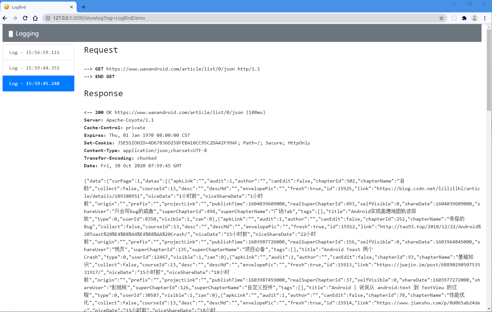

# LogBird
将OKHttp日志重定向到浏览器中

* APP端修改OkHttp拦截器将网络日志上报，
* 服务端利用Socket.io实时通讯，将日志发送至浏览器客户端页面。




### 服务端
1. 进入server文件夹执行 ``npm install``
2. 启动server: ``npm start``

### APP
1. 集成module
2. 初始化配置
```java
Interceptor loggingInterceptor = new LogBirdInteceptor(BuildConfig.DEBUG, new LogBirdInteceptor.LogHandlerImpl());

okHttpClient = new OkHttpClient.Builder()
    .connectTimeout(5000, TimeUnit.MILLISECONDS)
    .readTimeout(5000, TimeUnit.MILLISECONDS)
    .addInterceptor(loggingInterceptor)  // log拦截器
    .retryOnConnectionFailure(true).build();

// 设置日志Tag
Configuration.getInstance().setLogTag("LogBirdDemo");
// 设置日志上报服务端url
Configuration.getInstance().setLogBirdServer("http://192.168.0.30:3000/uploadlog");
```
3. 打开浏览器访问 ``http://192.168.0.30:3000/showlog?tag=LogBirdDemo``， tag参数与代码保持一致
4. 运行APP，查看Log
